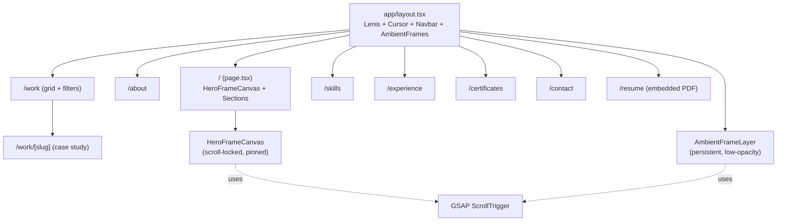

## Stack (locked)

- **Next.js 15** (App Router) + **TypeScript** + **static export** (`output: 'export'`) — gives true individual page URLs (`/about`, `/work`, `/contact`) with SEO that recruiters Googling "Naman Bhalani" will love; still deploys free to Vercel or GitHub Pages.
- **Tailwind CSS v4** + **shadcn/ui** primitives for premium components.
- **GSAP + ScrollTrigger** — industry-standard for the Apple-AirPods style scroll-locked frame sequence on `<canvas>`.
- **Framer Motion** for page transitions, magnetic buttons, hover previews, project popups.
- **Lenis** for buttery smooth scrolling (the single biggest "premium feel" upgrade).
- **EmailJS** (or Formspree) — free serverless contact form, no backend needed.
- **Lucide-react** icons, **next-themes** for light/dark, **Geist Sans + Geist Mono** typography.

## Architecture

## Folder structure (target — to be created later in your new folder)

- `public/frames/hero/` — your uploaded hero frame sequence (numbered `0001.webp` … `0240.webp` ideal)
- `public/frames/ambient/` — lighter, lower-res sequence for background of non-home pages
- `public/images/profile/` — your new professional photo (you'll provide later)
- `public/images/projects/` — project screenshots
- `public/images/certificates/` — migrated from current `img/` folder
- `public/resume.pdf`
- `src/app/` — routes (one folder per page, see diagram)
- `src/components/frames/` — `HeroFrameCanvas.tsx`, `AmbientFrameLayer.tsx`
- `src/components/work/` — `ProjectCard.tsx`, `ProjectHoverPreview.tsx`, `ProjectFilters.tsx`
- `src/components/shared/` — `CustomCursor.tsx`, `MagneticButton.tsx`, `PageTransition.tsx`, `PageLoader.tsx`, `SectionTitle.tsx`
- `src/content/` — `projects.ts`, `experience.ts`, `certificates.ts`, `about.ts` (typed data, single source of truth — easy to update later)
- `src/lib/` — `frames.ts` (preload + RAF helpers), `lenis.tsx`, `seo.ts`

## Frame animation engine (the WOW factor)

**Hero (home only, cinematic):**

- Pinned full-viewport section using GSAP ScrollTrigger's `pin: true`.
- Frames preloaded in parallel, drawn on `<canvas>` via `requestAnimationFrame`; scroll progress (0 → 1) maps linearly to `currentFrame = Math.floor(progress * (totalFrames - 1))`.
- Premium pre-loader shows "Loading experience… 47%" while frames decode — never reveals a half-loaded scene.
- Mobile: serve a 50%-resolution variant and 50%-frame-rate variant; ultra-low devices fall back to a static poster + CSS Ken-Burns effect.

**Ambient (every other page, persistent environment):**

- Fixed-position `<canvas>` at `z-index: -1`, `opacity: 0.18`, blurred ~6px.
- Advances slowly with page scroll (e.g. one frame per 40px scrolled, loops at the end).
- Different, smaller frame set (~60 frames, lower resolution) so it stays cheap.

**Assets you'll provide later:** a folder of numbered frames per layer. I'll add a tiny `scripts/optimize-frames.mjs` (sharp-based) that batch-converts whatever you drop into WebP at the right resolutions.

## Work page — advanced project showcase

- Grid with **filter chips** (All / Flutter / Android / Web / Python-Flask / AI-ML).
- **Hover-preview popup**: while hovering a project row, a floating card (Framer Motion `AnimatePresence` + cursor tracking) shows the project screenshot, animating in with parallax + scale.
- **3D tilt** on each card (custom hook, no library bloat).
- **Magnetic hover** on the "View case study" button.
- Click → routes to `/work/[slug]` — full case study with problem statement, approach, tech stack badges, image gallery (lightbox), GitHub link, live demo link.
- Search bar (Cmd-K palette optional later) to filter by name/tech.

## Updated content (deeper "senior developer" tone)

Rewriting your About copy from "5th-semester student… passionate about apps" to something like:

> "I build production-grade software across the stack — native Android (Java) and cross-platform mobile (Flutter/Dart), modern web (React, TypeScript, Tailwind), and backend services in Python with Flask REST APIs deployed on cloud (Firebase, Google Cloud). My recent IBM AI/ML internship deepened my work with Generative AI and deep-learning pipelines. I care equally about clean architecture, Data Structures & Algorithms, and shipping things people actually use. Currently in 5th semester B.Tech CSE (CGPA 8.5, Rank #1 in semester 1), open to SDE internships."

Skills section gets new groupings: **Languages** (Java, Python, Dart, JavaScript), **Mobile** (Flutter, Native Android, Jetpack), **Web** ( HTML/CSS, Tailwind, Bootstrap), **Backend & API** (Flask, REST, Firebase, SQLite, porstgrl), **Cloud & DevOps** (Google Cloud, Vercel, GitHub Actions), **AI/ML** (Generative AI, scikit-learn basics, deep-learning concepts), **Core CS** (DSA, OOP, Problem Solving).

LinkedIn (`linkedin.com/in/naman-bhalani-768274304`) and GitHub (`CodeOfNamanBhalani`) get prominent placement in the navbar and footer.

## Design language (premium)

- Dark theme by default, optional light toggle.
- Palette: near-black `#0a0a0a` base, off-white text, single bold accent (recommend electric violet `#7c3aed` to match your current vibe, with subtle cyan `#06b6d4` highlights).
- Typography: Geist Sans (200/400/700 weights) + Geist Mono for code/labels.
- Glassmorphism cards, gradient borders, subtle film-grain overlay, custom magnetic cursor that morphs on hoverable elements.
- Page transitions: cross-fade + subtle vertical slide via Framer Motion.

## Deployment + SEO

- Deploy to **Vercel** (recommended — instant, free, perfect for Next.js, custom domain support like `namanbhalani.dev`). Alternative: keep GitHub Pages — works with static export, will document both.
- Per-page `generateMetadata`, Open Graph image per route, JSON-LD Person/WebSite schemas (extended from current `index.html` schema), auto-generated `sitemap.xml` + `robots.txt` via `src/app/sitemap.ts`.
- Target Lighthouse 95+ on all axes after optimization.

## Assets you'll need to deliver later

1. Frame sequence folder for **hero** (cinematic) — 120–240 numbered frames recommended.
2. Frame sequence folder for **ambient** — 60–120 frames, optional (we can reuse the hero set decimated if you don't have a second one).
3. New **professional headshot** (replaces `img/naman_bhalani.jpg`).
4. Project screenshots/mockups for each Work entry (1 hero + 2–4 gallery shots per project).
5. Optional: a personal **logo/monogram** (otherwise we render a stylized "NB" mark).

## What survives from current site

- All certificate data and images (`img/`) → migrated to `src/content/certificates.ts` + `public/images/certificates/`.
- Resume PDF → `public/resume.pdf` + a real `/resume` viewer page.
- Existing JSON-LD `Person` schema → expanded.
- Project entries (Expense Control, Health Card, iSangit, Flutter Apps) → upgraded with case-study pages.
- Experience timeline (WhiteSton, Quicksend, IBM, ValueOfCodes) → animated timeline with media.

## README

A new `README.md` will be written that documents the stack, how to run locally (`npm i && npm run dev`), how to drop new frames into `public/frames/...`, how to add a project to `src/content/projects.ts`, and how to deploy. This is the only file I'd create before you hand me the new folder.

## Implementation phases (when you're ready to start)

1. Scaffold Next.js + Tailwind + Lenis + base layout, navbar, footer, design tokens.
2. Frame engine: `HeroFrameCanvas` + `AmbientFrameLayer` + preloader.
3. Home page composition (hero canvas + featured sections).
4. About, Skills, Experience pages with updated deeper copy.
5. Work page: grid + filters + hover preview + `/work/[slug]` case studies.
6. Certificates page: filterable gallery + lightbox (port from current logic).
7. Contact: form + EmailJS + success/error states.
8. Polish: custom cursor, page transitions, magnetic buttons, micro-interactions, full mobile pass.
9. SEO: metadata, OG images, sitemap, JSON-LD.
10. Deploy to Vercel, wire domain, add Plausible/Vercel Analytics.

